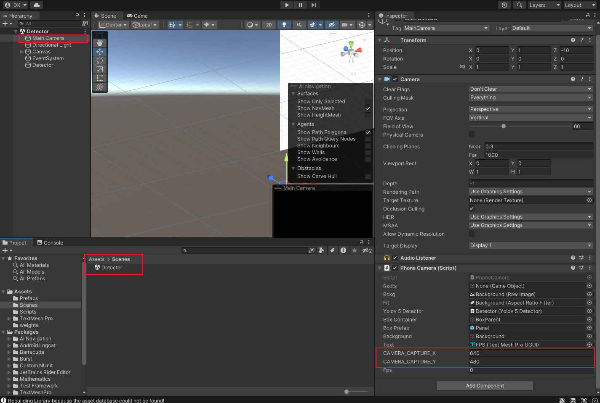
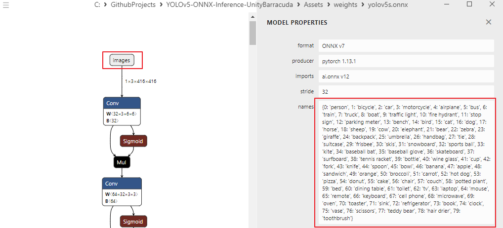

# YOLOv5-ONNX-Inference-UnityBarracuda


From start to finish with `YOLOv5 on Windows`: From custom training data to prepare `.onnx` file for `Android Unity Barracuda inference`.

This repository demonstrates `YOLOv5` inference in `Unity Barracuda` using an `.onnx` file.

For preparing custom data, training, and converting to `.onnx`, please refer to this [repository](https://github.com/wooni-github/YOLOv5-ONNX-Training-for-Unity):

1. ~~Prepare custom data and perform labeling using `CVAT`.~~

2. ~~Training with `YOLOv5` using PyTorch.~~

3. ~~Converting to `.onnx` for inference in Unity.~~

4. ~~Verify training results (`.onnx`) using a webcam.)~~

5. Inference in `Unity Barracuda`.


## 0. Prerequisites
- Unity (2022.2.15f1)
- Barracuda (3.0.0)
- Codeworks for Android (Android JDK, SDK) if needed

## 1. Settings & Running
```bash
# [git bash]
# clone this repository
git clone https://github.com/wooni-github/YOLOv5-ONNX-Inference-UnityBarracuda
```

Once the repository is loaded and a few settings are configured, inference can be performed.



Load `Detector` scene (double click), set the size of the camera capture in the `Main Camera` object.


Set the `confidence` and `IoU parameter` values, and assign your trained `.onnx` file to the `Model File`.

I have attached my trained `best.onnx` file and the `.onnx` file converted from the `.pt` file provided by `YOLOv5`, so feel free to try them out if you're curious. 

The `yolov5s.onnx` file has 80 classes, and you can check the class information using Netron.



The video below shows this repository running on a SAMSUNG Galaxy Tab S7+. 

If you have properly set up Unity and the Android JDK and SDK, you should be able to build and run it.


## Review


Ideally, if there is sufficient memory available (such as on a PC), the inference should be performed in the following order

1. Capture high-resolution camera image (e.g., 1920 x 1080)

2. Resize the captured image to the network size (416 x 416)

3. Perform `yolov5` inference using the `.onnx` file on the image from (2) and obtain bounding boxes

4. Draw the inferred bounding boxes on the original image (1920 x 1080)

However, this repository was intended for use on smartphones, and it was impossible to perform this process on my smartphone due to memory issues. 

Therefore, I captured a smaller image (640 x 480), assigned the center-cropped (416 x 416) image as the network input, and directly drew the inference results on the image.

---

This repository was developed with reference to the following repository:
- [yolov5-unity](https://github.com/egor-ulianov/yolov5-unity)

The following changes were made from the referenced repository:

- Enabled the use of various camera capture sizes and network sizes.
- No longer requires a label.txt file, as label information is obtained from the `.onnx` file.
- Similarly, the network's input and output sizes are obtained from the `.onnx` file.
- Automatically performs inference according to the number of labels.
